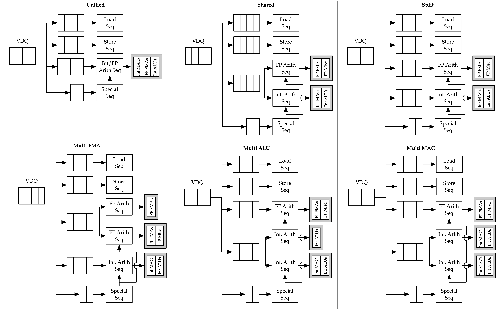
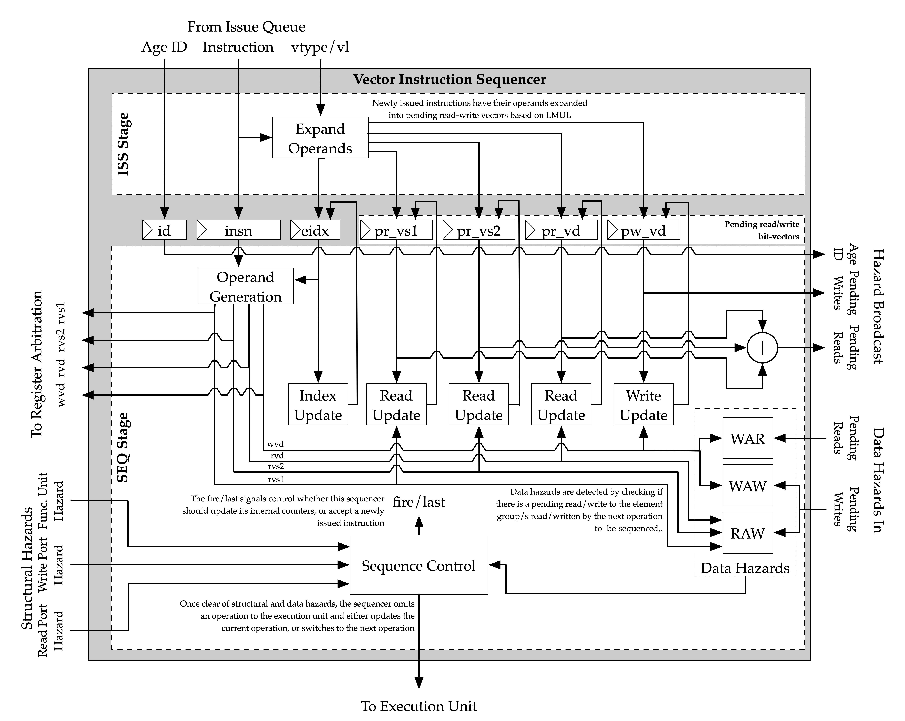
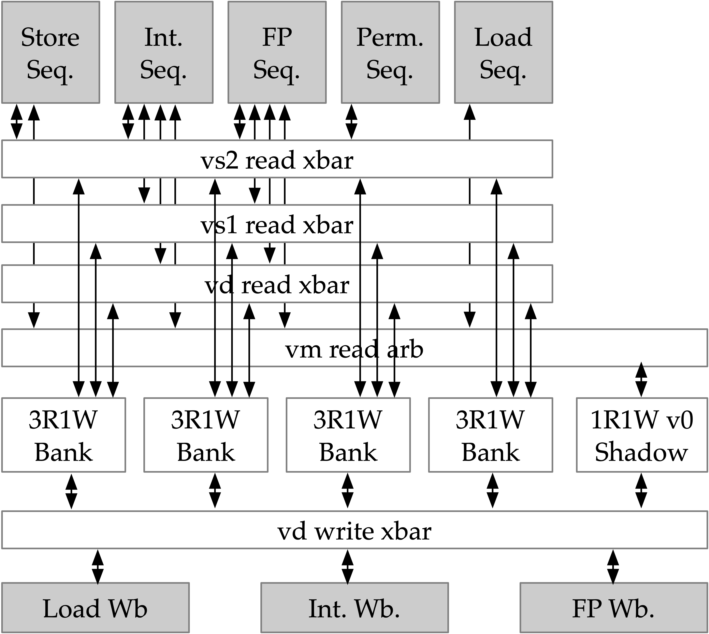

<<<
[[execute]]
== Vector Datapath

The vector datapath (VU) handles all vector instruction scheduling, computation, and register file access.
The VU is organized around independent "sequencing paths", which issue instructions independently to a per-sequencer vector execution unit (VXU).

The datapath is organized around a "vector element group" as the base unit of register access and compute.
An element group is a fixed-width `DLEN`-bits-wide contiguous slice of the architectural register file space.
`DLEN` guides the parameterization of most critical components in the backend.
The register file, load-path, store-path, and most functional units are designed to process DLEN bits per cycle (or 1 element group/cycle), regardless of element width (`ELEN`).

=== Issue Queues

Vector instructions entering the VU are immediately assigned a unique age tag and enqueued into an in-order dispatch queue (VDQ).
The age tag is used to disambiguate age when determining data hazards in the out-of-order sequencing stage.
This means the age tag is wide enough to assign a unique tag to every inflight operation in the backend.
Age tags are recovered when instructions complete execution.

The VDQ provides a low-cost decoupling queue between the VU and the VLSU.
The dequeue side of the VDQ is connected to the vector issue queues (VIQs).
Each VIQ issues instructions in-order into its corresponding instruction sequencer.
Execution across the VIQs may be out-of-order, as the VIQs may naturally "slip" against each other.

Each sequencing path has an independent issue queue.
The load issue queue only needs to track a destination address and mask enable, while the store issue queue only needs to track a source address and mask enable.
The arithmetic issue queue(s) must track up to three source operands along with the destination and mask enable.
The special issue queue, used for index generation, register gathers, slides, compress, and reductions, tracks only a source operand.

There are six currently supported configuration options for the issue queue and sequencer topology.

[.text-center]
.Issue queue configurations

 * The *unified* configuration features a single sequencer for all arithmetic operations fed by a VIQ. This configuration has the lowest hardware cost, but cannot simultaneously saturate integer and floating-point functional units.
 * The *shared* configuration features separate integer and floating-point sequencers fed by a common VIQ.
 Instructions are issued from the shared VIQ to either the integer or floating-point sequencer.
 This configuration can simultaneously saturate integer and floating-point execution units with well-scheduled code, requiring the interleaving of integer and floating-point operations.
 * The *split* configuration features separate integer and floating-point sequencers each fed by an independent issue queue. This configuration is the most performant and the most flexible, as it can dynamically schedule out-of-order across integer and floating-point instructions. It incurs additional area costs owing to the separate floating-point issue queue.
 * The *multi-ALU* configuration adds an additional integer sequencer and functional units to enable dual-issue of integer ALU operations
 * The *multi-MAC* and *multi-FMA* configurations add additional integer or floating point sequencers along with functional units to enable dual-issue of integer or floating-point multiply-accumulate operations, respectively. This creates an "unbalanced" machine with respect to the vector memory bandwidth that increases the maximum performance of the machine for kernels with sufficient reuse.

=== Operation Sequencers

[.text-center]
.Vector instruction sequencer

The instruction sequencers convert a vector instruction into a sequence of operations that execute down the functional unit datapaths, one operation per cycle.
The sequencers advertise the requested register file read and write addresses for the next operation, as well as the age tag for the currently sequenced instruction.
If there are no structural hazards from non-pipelined functional units or register file ports and there are no data hazards against older vector instructions, a sequencer will issue an operation and update its internal state.
An instruction will depart a sequencer along with the last operation it sequences, eliminating dead time between successive vector instructions.

Notably, the sequencers enact "fire-and-forget" operation issue.
Once an operation is issued by a sequencer, it is guaranteed to be free of further structural or data hazards as it proceeds down the pipelined VFU datapaths.
This eliminates the need for costly operand or result queues and obviates back-pressure in the functional unit pipelines.

==== Load/Store Sequencers

The load-store sequencers (VLS/VSS) are the simplest, as they only track one vector operand or destination.

The VLS sequences load writebacks into the VRF.
The VLS will stall if the decoupled load response port from the VLSU has not presented a requested element group of write-back data.
Since the VLSU's load path and the load-issue path are both in-order, issued operations from the VLS pop the next element group from the decoupled load-response port and write into the VRF.

The VSS behaves similarly to the VLS, except it sequences element groups of data into the decoupled store-data port.
The store data-port can de-assert ready to stall the store sequencer.

Both the VLS and VSS handle the additional complexity segmented operations, which write a set of consecutive vector registers.
To align with the data order expected in the segment buffers in the VLSU, the sequencers execute two nested loops to handle these instructions. The outer loop iterates over element group index, just as in normal vector instructions, while the inner loop iterates over the number of fields in the segmented instruction.

==== Execute Sequencer

The execute sequencers (VXSs) sequence all arithmetic operations.
They track up to three register operands, with up to four reads and one write per operation (for a masked FMA).
Each VXS issues to a single vector execution unit (VXU).
A VXU is a collection of vector functional units (VFUs).
The VXSs will stall operation execution if the requested VFU within its VXU is unavailable.

==== Special Sequencer

The special sequencer (VPS) handles three classes of special-case instructions which enqueue a special sequencing operation into this sequencer, while the main instruction control is still consumed by either the VLS, VSS, or VXS.
Using the VPS as an independent sequencer divides the read operand hazard tracking from the destination operand hazard tracking, enabling chaining naturally for both source and destination operands even if they are consumed at different rates.

For *indexed memory instructions*, the VLSU's address-sequencing unit needs to process indices fetched from the register file.
These instructions enter the VPS in addition to the VLS or VSS.
The out-of-order sequencing support enables the VPS to run ahead of the VLS or VSS, feeding indices to the VLSU while older loads or stores might still be inflight.

For *slides*, the VPS sequences reads for the source operand.
DLEN-wide read-data is fed to a rotation circuit and buffer to align them for writeback, which is sequenced by a VXS.
This enables slides to proceed at DLEN bits/cycle.

For *compress* and *register gather*, the VPS sequences element-wise reads for the source operand.
Elements enter an element buffer, which is accessed by the VXS when it sequences element-wise writebacks.

For *reductions*, the VPS maintains a DLEN-wide accumulation buffer.
The VPS performs the initial read of element 0 to populate the accumulation buffer.
Once available, the VPS provides the accumulation buffer for the VXSs to access, and stalls the VXS for long-latency accumulates.

=== Hazards

Due to the out-of-order execution across the different sequences, RAW, WAW and WAR hazards are all possible.
Furthermore, supporting vector chaining implies that these hazards should be resolved at sub-vector-register granularity.
Since Saturn is designed around `DLEN`-wide element groups as the base throughput of the machine, Saturn resolves data hazards at `DLEN` granularity.
The scheduling mechanism precisely tracks which element groups an instruction or operation has yet to read-or-write to interlock the sequencers.

In Saturn, the "out-of-order instruction window" includes all instructions in the issue queues (but not the VDQ), the instructions currently in progress within the sequencers, and any operations which have not yet completed execution in the functional unit datapaths.
All instructions in this window must advertise a precise set of element groups that have not yet read or written, along with the age tag of the instruction.

 * Instructions in the issue queues already contain their operand specifiers. Since these instructions have not yet been sequenced, a conservative bound on the element groups to be accessed can be easily computed using the `LMUL` and the base register operand.
 * The sequencers track a precise bit-vector of element groups that the currently-sequenced instruction may still access. For regular vector instructions that access their operands sequentially, the sequencers can clear these bits with each issued operation. For irregular vector instructions, the sequencers can conservatively leave these bits set.
 * Operations inflight in the functional units that have yet to write back track a single element group of the write destination.

The advertised information across the out-of-order window is aggregated into a pending-read and pending-write one-hot vector for each sequencer.
These one-hot vectors each contain one element for each architectural element group in the VRF, which is 32xVLEN/DLEN (a typical total value being 64).
These one-hot vectors are constructed using an age filter based on the age tag of the current instruction in the sequencer and the age of each operation in the out-of-order window.
The age filter restricts the pending-read and pending-write vectors to only pending reads and writes from instructions older than the currently sequenced instruction.

In some cases, the relative age is unambiguous, so no age filter is needed.
Instructions in the sequencer are inherently older than instructions from the feeding issue queue for that sequencer, so no age filter is needed.
Sequenced operations in the VFUs are inherently the oldest writes to any element group, so no age filter is needed for these either.

Each sequencer computes the element groups that will be accessed or written to by the next operation to be issued, and determines if a pending older read or write to those element groups would induce a RAW, WAR or WAR hazard.
If there is no data hazard and there is no structural hazard, the operation can be issued, with the sequencer incrementing its internal element index counter, or draining the instruction.

For vector instructions with regular consecutive access patterns, the last issued operation that accesses some element group can clear the sequencer's internal bit-vector of pending reads and/or writes.
This frees younger vector instructions in other sequencers to chain off this element group as soon as possible.

=== Vector Register File

The VRF is organized as a multi-ported banked array of flops.
The architectural register file is striped across the banks by element group index.
Neighboring element groups reside in neighboring banks.
Each bank contains 3 read ports and 1 write port, to fulfill the minimum read requirements of a three-input fused-multiply-add.
The generator supports generating VRFs with 1, 2, or 4 banks.
Configurations that expect to keep multiple integer sequencers utilized simultaneously will prefer more banks to meet the increased read bandwidth requirements.

As an optimization, Saturn implements per-bank single-entry fall-through write buffers, effectively emulating a 3R2W memory with a 3R1W memory.
Write bank conflicts between pipelined writebacks and load writebacks can result in a performance penalty.
The write buffer 

[.text-center]
.Banked vector register file for a 4-bank configuration

A shadow copy of  vector mask register `v0` is maintained in a 1R1W memory to avoid provisioning an extra read port for the bulk banked register file.

A read crossbar connects the issue port of the sequencers to the register file read ports.
The read crossbar resolves structural hazards during the read stage and stalls the sequencers if necessary.
The read stage also arbitrates for access to the write ports across multiple fixed-latency execution paths.

=== Functional Units

Each execution unit is composed of some set of functional units.
Operations are issued to functional units along with their vector operands.
Functional units can either be pipelined or iterative.

Pipelined functional units have fixed execution latencies, so once an operation is issued, it will execute without stalling.
The sequencing mechanism checks for future write port conflicts on the target VRF bank across inflight and simultaneously sequenced operations to ensure that the next sequenced operation will not induce a structural hazard on the write port in the future.
If a conflict is detected, the younger operation will be stalled and will likely start executing the very next cycle.
This allows the operations to then proceed across the banks without any further conflicts with each other, barring other hazards.

Iterative functional units have variable execution latencies or contain expensive hardware such that it is desirable to execute at a rate of just one element per cycle.
Once an iterative functional unit has completed its operation on a given element, it will arbitrate for the target VRF write port, write the result, then assert readiness to accept a new operation from the sequencer.

[cols="2,3,2,2,3"]
|===
|Name|Instruction support|Microarchitecture/s|Structure|Notes

|IntegerPipe
|Integer add/sub/max/min
|SIMD-array of ALUs
|2-stage pipeline
|Only saturating-adds writing back in the second stage, while all other instructions write-back in the first stage

|ShiftPipe
|Shift instructions
|SIMD-array of barrel-shifters
|2-stage pipeline
|

|BitwisePipe
|Bitwise operations
|Bitwise array
|1-stage pipeline
|

|BitmanipPipe
|Bit-manipulation instructions (Zvbb)
|Mixed-element-width priority-encoders
|2-stage pipeline
|

|PrefixUnit
|Prefix-like instructions (popc/first/sbf/iota/etc.) and scalar-writebacks
|Prefix-sum circuit with accumulator
|Stateful 1-stage pipeline
|

|IntegerDivider
|Integer divide (opt. multiply)
|Iterative FSM
|Iterative-elementwise
|Can also support integer-multiply in area-minimal configurations

.2+|MultiplyPipe
.2+|Integer multiply
|Single elementwise multiplier
.2+|3-stage pipeline
.2+|For area-minimal configurations, avoid building the SIMD array
|SIMD array of multipliers

|PermuteUnit
|Slides, gathers, compress
|Minimal logic
|1-stage pipeline
|Manages the writebacks for register-permutation instructions

.2+|FMA
.2+|Floating-point multiply/adds
|Port to host CPU's FPU
.2+|4-stage pipeline
.2+|For area-minimal vector units, share the FPU with the host CPU
|SIMD array of FMAs

|FPDivSqrtUnit
|Floating-point divide, square-root
|Single iterative unit
|Iterative-elementwise
|

|FPConvPipe
|Floating-point convert/compare
|SIMD array of FP units
|2-stage pipeline
|

|===

// === EVA (Extended Vector Architecture) Port

// The EVA port provides an interface for integrating the Saturn vector unit with custom accelerators or functional units.
// Physically, this interface appears allows users to integrate a custom functional unit accepting some subset of the empty RVV encoding space.
// Like all other functional units, a EVA-attached functional unit must advertise the pending reads or writes a current in-flight operations will make into the VRF.
// This allows Saturn's instruction sequencers to schedule EVA instructions alongside standard vector instructions, and enables chaining to and from EVA instructions.

// A EVA accelerator implementation should additionally be parameterized by `VLEN` and `DLEN`, to match the range of possible Saturn configurations it may be attached to.

// The EVA interface is a port that exposes data read from the VRF along with control signals, and can take in data from the external unit and write it into the VRF.
// A key idea of the EVA interface is that it enables Saturn to execute custom instructions that specify VRF sources and destinations just like standard vector instructions.
// This allows Saturn to sequence these instructions alongside standard vector instructions, using very similar mechanisms.
// This enables the external accelerator or functional unit to utilize the Saturn vector unit as a base of compute and communicate with it over a high-bandwidth interface.

// TODO add more details
