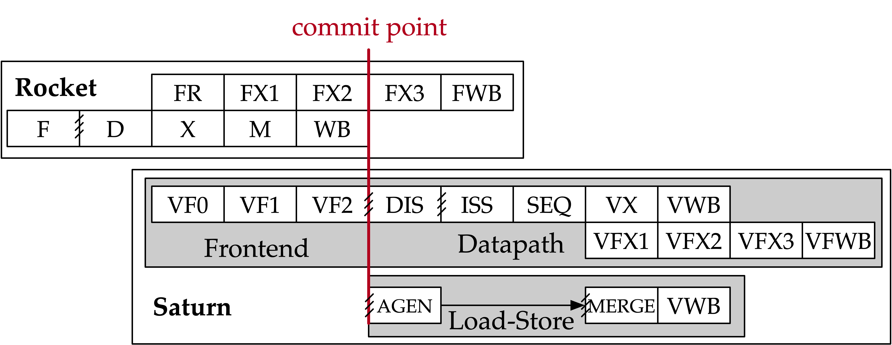
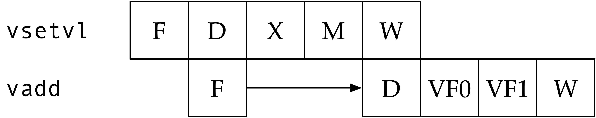
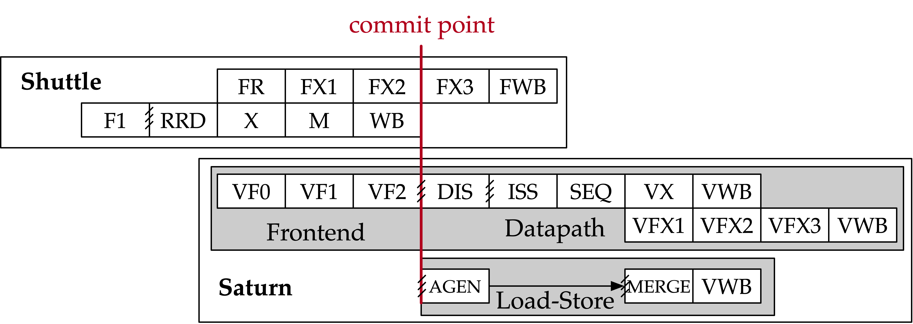
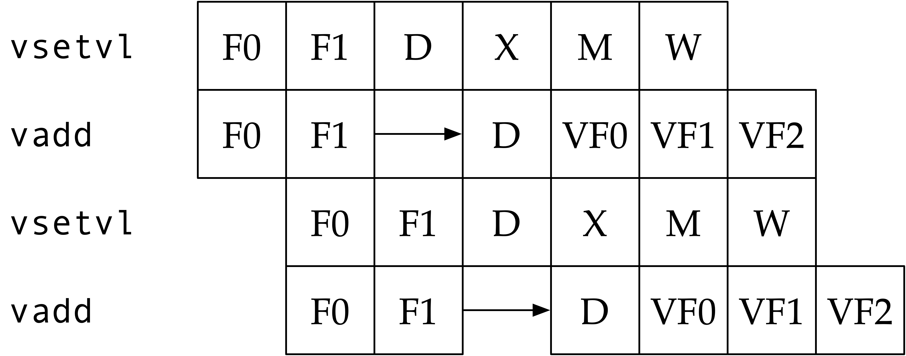

<<<
[[frontend]]

== Vector Frontend

Vector instructions are dispatched to the VFU from an early stage in the host core's pipeline.
These instructions must be dispatched along with updated values of `vtype` and `vl`, to control the trap-checking mechanisms.
The *pipelined trap checker (PTC)* and *iterative trap checker (ITC)* units perform memory translation for vector memory instructions, and either validate the absence of a memory access-related trap or generate a precise trap ahead of the commit point in the host core.
Instructions that are validated to be free-of-traps are dispatched to the VLSU and VU.

=== Core Integration

Saturn currently supports integration into either https://github.com/ucb-bar/saturn-vector-impls/tree/master/src/main/scala/rocket[Rocket] or https://github.com/ucb-bar/saturn-vector-impls/tree/master/src/main/scala/shuttle[Shuttle] as the host scalar RISC-V core.
The host cores are responsible for decoding vector instructions that must be dispatched to the VFU, in addition to updating and supplying the `vtype` and `vl` CSRs to these instructions.

Rocket and Shuttle expose nearly identical interfaces to the vector unit.
The scalar pipeline dispatches vector instructions to the VFU pipeline at the X stage, immediately after scalar operands are read from the scalar register files.
The scalar pipeline also must provide these instructions with up-to-date values of `vtype`, `vl`, and `vstart`.
The `M` stage exposes a port through which the `VFU` can access the host core's TLB and MMU.
The `WB` stage contains interfaces for synchronizing committing or faulting vector instructions with the scalar core's instruction scheme and stalling scalar instruction commit if necessary.
The `WB` stage also exposes interfaces for modifying `vstart` and `vconfig` as vector instructions commit.

[discrete]
==== Rocket

[.text-center]
[#rocket]
.Rocket's pipeline stages with Saturn attached. Hatched lines indicate FIFO queues between pipeline stages.

Rocket is a 5-stage in-order single-issue core.
As shown in <<rocket>>, the Saturn VFU integrates into execute (`X`), memory (`M`), and write-back (`WB`) stages of Rocket, where the `WB` stage is the commit point.
At the `WB` stage, vector instructions which cannot retire due to ongoing activity in the ITC can kill all younger instructions in the earlier pipeline stages and request the core to re-fetch and replay the instruction at the next PC.

[.text-center]
[#rocket-vset]
.`vset`-induced bubble in Rocket

Rocket does not maintain a speculative copy of the `vtype` and `vl` CSRs at the decode (D) stage, so a data hazard can interlock the D stage whenever a vector instruction proceeds a `vset` instruction.
As showin in <<rocket-vset>>, a `vset` will always induce a 2-cycle bubble on a proceeding vector instruction.
The effect of this is most noticeable in short-chime mixed-precision vector code, in which `vset` instructions are frequent.

[discrete]
==== Shuttle

[.text-center]
[#shuttle]
.Shuttle's pipeline stages with Saturn attached. Hatched lines indicate FIFO queues between pipeline stages.

Shuttle is a 6-stage in-order superscalar core, typically configured as 2-issue or 3-issue.
The Saturn VFU integrates into the execute (X), memory (M), and write-back (W) stages of Shuttle, where the W stage is the commit point.

Only one of the execution pipes in Shuttle can dispatch into the VFU, but any of the pipes can execute a `vset` operation.
However, during steady-state operation, Shuttle can dynamically construct instruction packets at the `D` stage to maximize instruction throughput given structural hazards by stalling partial instruction packets.

Similar to Rocket, vector instructions which cannot retire at the W stage will kill younger instructions in the pipeline and request a refetch and replay of the subsequent instruction.

[.text-center]
[#shuttle-vset]
.Shuttle dual-issue with forwarding of `vset`

Unlike Rocket, Shuttle implements a bypass network for `vset` instructions modifying `vtype` or `vl`.
Vector instructions following a `vset` instruction do not need to stall, as the `vtype` and `vl` operands can be accessed through the bypass network.
However, a vector instruction cannot be issued in the same instruction packet as a `vset`: it must proceed on the next cycle instead.
<<shuttle-vset>> shows how Shuttle can dynamically stall a partial instruction packet with the `vadd` to issue it with a younger `vset` on the next cycle.
This example also depicts how stalling the `vadd` maintains 2 IPC through Shuttle and 1 IPC into the vector unit.

=== Memory Translation and Traps

Vector instructions dispatched into the VFU first execute through the pipelined trap checker (PTC).
Instructions for which the PTC cannot conservatively guarantee to be free of traps are issued to the ITC.
Instructions that pass the PTC successfully can then be dispatched to the VU and VLSU after they pass the commit point.

Since vector instructions may be speculative ahead of the commit point, any vector instruction killed by the scalar core is also killed in the VFU.
The PTC/ITC design pattern achieves the goal of making common case vector instructions fast, through the PTC, while preserving correct precise trap behavior for all vector instructions through the ITC.

The PTC and ITC share access to a single TLB port in the VFU.
This TLB port would typically access the scalar core's TLB.
Future modifications to Saturn could supply a dedicated vector TLB instead.

[discrete]
==== Pipelined Trap Checker (PTC)

The Pipelined Trap Checker is designed to handle common vector instructions without stalling the pipeline at 1 IPC.
Vector instructions fall into one of the following categories

 * *Single-beat* vector instructions include arithmetic instructions and vector memory instructions for which the extent of the access can be bound to one physical page, at most. This includes unit-strided vector loads and stores that do not cross pages, as well as physically addressed accesses that access a large contiguous physical region. These are the most common vector instructions and need to proceed at high throughput through the VFU
 * *Multi-beat* vector instructions are memory instructions for which the extent of the instruction's memory access can be easily determined, but the range crosses pages. These are somewhat common vector instructions, and must not incur a substantial penalty
 * *Iterative* vector instructions include masked, indexed, or strided memory instructions that might access arbitrarily many pages. These instructions would fundamentally be performance-bound by the single-ported TLB, so the VFU can process these instructions iteratively

In stage-0 (VF0), the PTC establishes which category a vector instruction belongs to.
Note that this does not require memory translation and can be quickly determined from the instruction opcode, base address offset, and current settings of `vtype` and `vl`.

Single-beat instructions execute down the PTC pipeline with no stalls.
In stage-1 (VF1), the accessed page for single-beat memory operations is checked through the TLB port.
In stage-2 (VF2), misses in the TLB flush the PTC, forcing the VFU to request a replay of the vector instruction.
This mirrors how the host in-order core handles scalar TLB misses through a replay mechanism.

If the VF2 TLB response indicates an access fault or page fault, retirement of the instruction is blocked, and the instruction is issued to the ITC to determine if it traps.
This is done because masked vector memory operations that access invalid addresses do not generate traps, and the ITC maintains the capability to access the vector register file for mask data.

Multi-beat instructions incur multi-cycle occupancy of the PTC.
The VF1 stage computes the number of elements within the first page, then updates `vstart` and requests a replay from the scalar core at the same PC.
The replayed instruction will see a non-zero `vstart`, compute an updated base address at the next page, request a replay if the remaining elements cross pages, and so on, until all the pages have been checked.
In the VF2 stage, the PTC will correctly set the `vstart` and `vl` signals for the vector instructions dispatched into the VU and VLSU to correctly set the partial execution of such instructions.
In effect, the PTC cracks page-crossing contiguous loads and stores into single-page operations.

[discrete]
==== Iterative Trap Checker (ITC)

Iterative instructions cannot be conservatively bound by the PTC.
Instead, these instructions perform a no-op through the PTC and are issued to the ITC.
Unlike the PTC, which operates page-by-page, the ITC executes element-by-element, requesting index and mask values from the VU for indexed and masked vector operations.
The ITC generates a unique address for each element in the vector access, checks the TLB, and dispatches the element operation for that instruction to the VU and VLSU only if no fault is found.
Upon a trap, the precise element index of the access that generates the trap is known, and all accesses preceding the faulting element would have been dispatched to the VU and VLSU.

The ITC accesses the TLB through the same port as the PTC.
The ITC also can access the VRF through the VU to fetch index or mask data.

=== Memory Disambiguation

Vector memory instructions appear to execute sequentially with the scalar loads and stores generated by the same hart.
Scalar stores cannot execute while there is a pending older vector load or store to that same address.
Scalar loads cannot execute while there is a pending older vector load to that same address.
Furthermore, the scalar store buffer must be empty when dispatching a younger vector memory operation, since the vector memory path does not check the contents of the scalar store buffer.

The S2 stage of the PTC also receives the physical address of the current in-flight scalar load or store about to commit in the host scalar core's W stage.
This address is checked against the older inflight loads and stores in the VLIQ and VSIQ in the VLSU.
On a match, a replay for the younger scalar load or store is requested.

To avoid RAW or WAW hazards against scalar stores in a scalar store buffer, the PTC stalls dispatch of vector instructions in the S2 stage until the scalar store buffer is empty.
We observe that this requirement has minimal impact on most vector codes, as scalar stores are rare in stripmined loops.

=== Interface to VU and VLSU

The `VectorIssueInst` bundle presented to the VU and VLSU contains the instruction bits, scalar operands, and current `vtype`/`vstart`/`vl` settings for this instruction.
For memory operations, this bundle also provides the physical page index of the accessed page for this instruction, since the PTC and ITC crack vector memory instructions into single-page accesses.
For segmented instructions where a segment crosses a page, `segstart` and `segend` bits are additionally included in the bundle, to indicate which slice of a segment resides in the current page.

