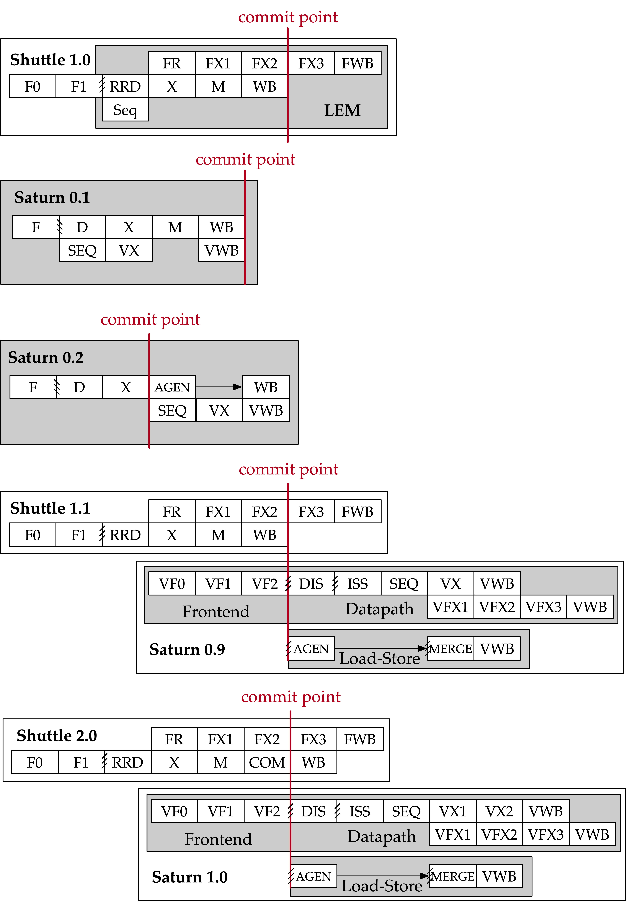

<<<
[[history]]

== History

=== Prior Vector Implementations

Saturn draws from a long line of prior vector units.

==== Torrent-0

T-0 cite:[t0] was an early demonstration of the principles of instruction scheduling in short-vector microarchitectures.
Torrent demonstrated a decoupled-access-execute-style microarchitecture with efficient scheduling of short-chime vector instructions.
However, Torrent relied on fixed memory and pipeline latencies for instruction scheduling, relying on a global stall to handle cache misses.

Many ideas presented in Torrent have been refined toward implementations of a modern vector ISA like RVV.
Precise faults, segmented memory operations, register grouping, and mixed-precision instructions are modern innovations in vector architectures that have significant implications on vector microarchitectures and instruction scheduling.

==== Hwacha

Hwacha cite:[hwacha_manual] was a decoupled-fetch vector unit designed to support scalability to many-lane designs.
Microarchitecturally, Hwacha is a classic "long-vector" machine, with deeply temporal vector execution distributed across parallel independent vector lanes.
Each vector lane contained an independent instruction sequencer, independent functional units, a slice of the register file, and an independent memory port.
Like Saturn, Hwacha was implemented in Chisel and could integrate with Rocket as a post-commit decoupled unit.

Notably, Hwacha executes a unique "decoupled vector fetch" ISA.
In Hwacha's ISA, vector code is encoded in "vector fetch blocks".
These vector fetch blocks are independently fetched and executed by a limited frontend in the vector unit, instead of being embedded in the same sequential instruction stream as scalar code.
Programmers are expected to describe stripmine loops as these vector fetch blocks, and dispatch pointers to these blocks to the vector unit via "vector fetch" instructions.
Hwacha's ISA also does not require scala-vector memory ordering or support precise faults, simplfying Hwacha's microarchitecture for address translation and disambiguation.

The component of Hwacha's microarchitecture most relevant to modern scalable vector ISAs is the instruction sequencer.
However, Hwacha's instruction sequencer is designed for the needs of a deeply temporal long-vector implementation, rather than a short-chime vector unit like Saturn.
Hwacha's sequencer imposes a small structural dead-time overhead as instructions do not drain from the sequencer until their final element has been written back fully.
This results in high sequencer entry pressure for short-chime vector code blocks.
Compared to Hwacha's sequencer, Saturn's sequencers aggressively drain short-chime instructions without requiring long occupancies in limited structural resources.

==== LEM

LEM was an experimental microcoded RVV vector unit designed around an early variant of the Shuttle superscalar core.
Some ideas around instruction decode in LEM inspired the vector decode generators in Saturn.
LEM was the first Chisel implementation of an RVV-compliant vector unit.

=== Timeline

The Saturn project began in the fall of 2021 with a vision to develop a standard base vector implementation for hosting specialized accelerators.
Early iterations of Saturn explored different design approaches to compact vector implementations, including shallow-pipeline systems, merged scalar-vector implementations, and partial implementations of the full RISC-V Vector ISA.

[.text-center]
[#evolution]
.Evolution of Saturn towards the final design

Saturn 0.1 implemented an aggressive ahead-of-commit vector pipeline, with a custom scalar core implementation.
Saturn 0.1 had unstable and unpredictable performance characteristics due to the complex set of interlocks needed to enable parallel vector and scalar execution.
Specifically, allowing for variable-chime instruction execution significantly increased the complexity of the tightly integrated vector unit due to the implications on instruction occupancies of shared scalar/vector pipeline structures.
Only a small subset of vector instructions were supported on this implementation.

Saturn 0.2 implemented a post-commit vector unit behind a custom-designed superscalar core with a very shallow pipeline and no support for virtual memory.
A shared scalar-vector load-store-unit executed both scalar and vector memory operations post-commit, with a specialized high-bandwidth non-blocking L1 data cache fulfilling both scalar and vector memory requests.
A very shallow three-stage pipeline pre-commit attempted to mitigate high scalar-load-use penalties, but this precluded support for virtual memory.
Saturn 0.2 did implement the first version of the instruction sequencing mechanism used in Saturn 1.0.

Saturn 0.9 began development in the fall of 2023 with a complete rewrite over prior versions.
The desire to support complete RVV alongside a fully-featured scalar core was motivated by the observation that accelerator architects generally expect mature software stacks and well-behaved core implementations for scalar control code.
Furthermore, learnings from Saturn 0.1 and 0.2 suggested that a "three-stage" load path, with ahead-of-commit fault checking, early post-commit load-address-generation, and late post-commit load write-back, would adequately address performance requirements while remaining compliant to the ISA.

The decoupled-access-execute architecture with an aggressive yet precise vector frontend became the dominant design paradigm driving the rest of Saturn 0.9's microarchitecture.
The implementation of Saturn focused on developing a robust precise fault mechanism, load-store path, and dynamic out-of-order instruction issue in that order.
Once the microarchitecture around dynamic vector scheduling with chaining was refined, implementation of the functional units proceeded expediently.
After the first vector integer ALU was implemented, the rest of the vector instructions were brought up in three months.

At the time of writing, Saturn 0.9 has been taped out twice.
In spring 2024, a conservative multi-core Saturn configuration attached to Rocket was taped out out as part of Berkeley's undergraduate tapeout course.
Concurrently, a more aggressive heterogeneous clustered multi-core of Saturns attached to Shuttle cores was taped out in a research SoC.

Saturn 1.0 was developed alongside Shuttle 2.0, leveraging physical design experience from the prior tapeouts.
Saturn 1.0 contained many critical path and area optimizations and was released in the fall of 2024 along with this microarchitecture manual.

=== Contributions

Jerry Zhao led the Saturn project and implemented the instruction scheduling mechanism, load-store unit, and scalar-core integration.
Daniel Grubb led the implementation of the SIMD floating-point units and the Saturn physical implementation and contributed to the core subsystems of the vector backend.
Miles Rusch implemented several variants of SIMD integer multipliers.
Tianrui Wei assisted with early versions of Saturn and performed key work that would evolve into the 1.0 version.

Kevin He, Nico Casteneda, and Mihai Tudor led a tapeout of a conservative Saturn with Rocket implementation as part of Berkeley's undergraduate tapeout course.
Kevin Anderson, Daniel Grubb, and Vikram Jain led a research tapeout of a DSP-optimized chip with heterogeneous clusters of Saturns.

Many people have contributed to projects that have led to Saturn.
John Fang developed LEM, exploring the challenges of generating efficient vector decode structures.
Albert Ou's thesis work highlighted use cases for Saturn-like vector units in accelerating DSP kernels.

Lastly, the wisdom of former graduate students who have developed vector units during their tenures has proven instrumental to the development of Saturn.
Conversations with Albert Ou, Colin Schmidt, Andrew Waterman and Chris Batten have all been insightful.

=== Funding

Research was partially funded by SLICE Lab industrial sponsors and affiliates, and by the NSF CCRI ENS Chipyard Award #2016662.
Any opinions, findings, conclusions or recommendations expressed in this material are those of the author(s) and do not necessarily reflect the views of the National Science Foundation.
