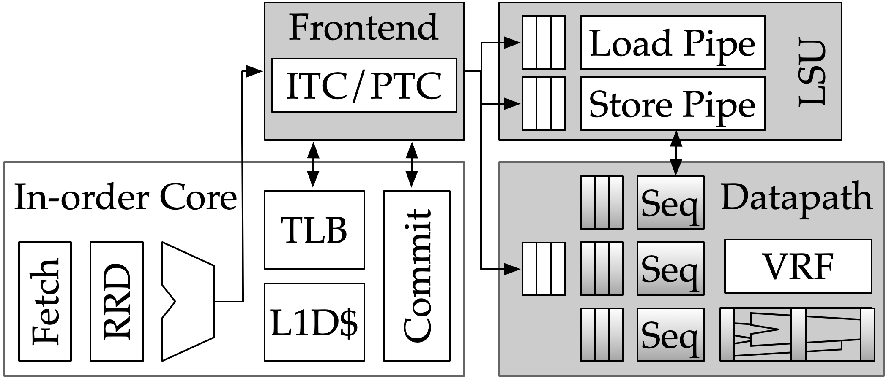

[[intro]]
== Introduction

[.text-center]
.High level overview of the Saturn Vector Unit

This manual describes in detail the Saturn Vector Unit, a parameterized and extensible vector microarchitecture executing the RISC-V vector extension.
Saturn was developed to address an academic need for a representative, compliant, and highly-flexible generator of RISC-V vector units targeting deployment in domain-specialized cores.
//Saturn is divided into a vector frontend (VFU), vector load-store unit (VLSU), and vector datapath (VU).
//These components are designed to integrate into existing area-efficient scalar RISC-V cores.
Saturn is implemented as a parameterized Chisel RTL generator, enabling a range of possible Saturn configurations across many target deployment scenarios.
This document discusses the microarchitectural details of all Saturn components.

 * <<objectives>> describes the motivation for Saturn and how Saturn compares to existing data-parallel microarchitecture archetypes
 * <<system>> discusses the system-organization of Saturn as well as the core design principles behind its microarchitecture
 * <<frontend>> describes the microarchitecture of Saturn's vector frontend unit
 * <<memory>> describes the microarchitecture of Saturn's vector load-store unit
 * <<execute>> describes the microarchitecture of Saturn's datapath and vector instruction sequencers
 * <<design-space>> lists the parameter space of the Saturn generator
 * <<programming>> provides guidance on writing efficient vector code for Saturn
 * <<history>> discusses the historical context of Saturn within past academic vector units

//, as well as the justification for Saturn's design decisions and alternative approaches.
//Performance, power, and area evaluations from several Saturn configurations are presented along with a brief design space exploration of key microarchitectural parameters.
//We additionally contextualize Saturn against the large body of existing commercial and academic vector units.

//This manual is intended to be a "living document" that will evolve to capture future modifications and additions to Saturn.
Questions, bug reports, or requests for further documentation can be made to jzh@berkeley.edu.
