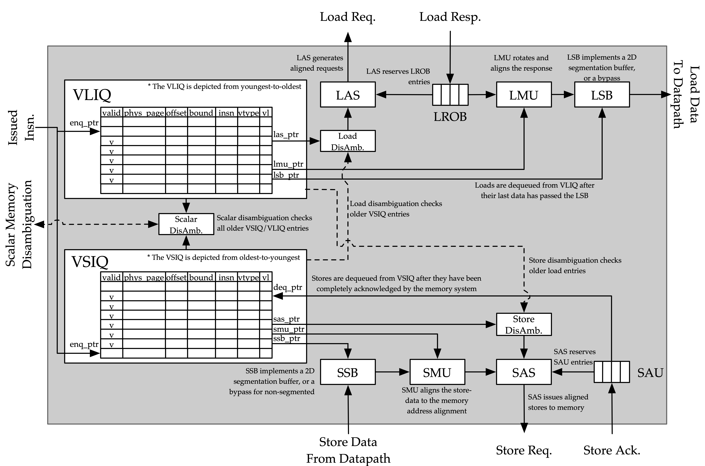
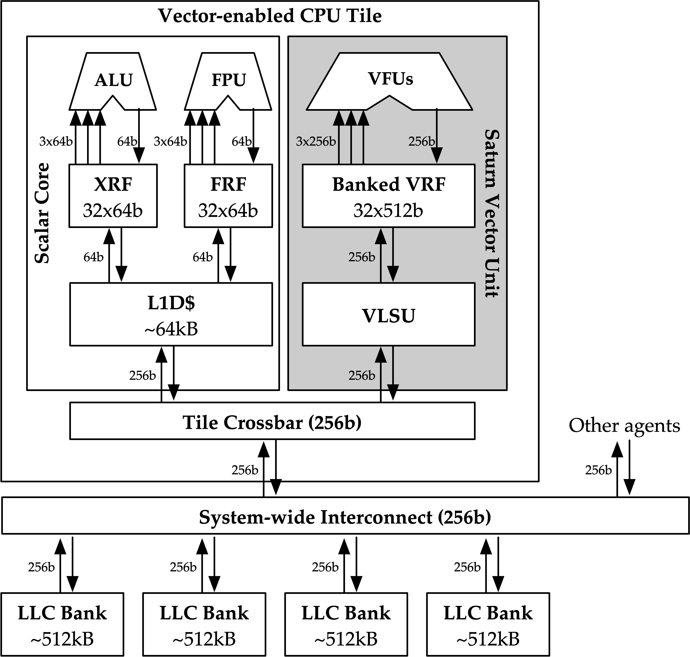
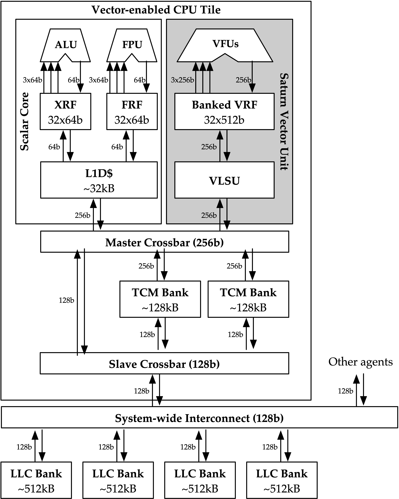
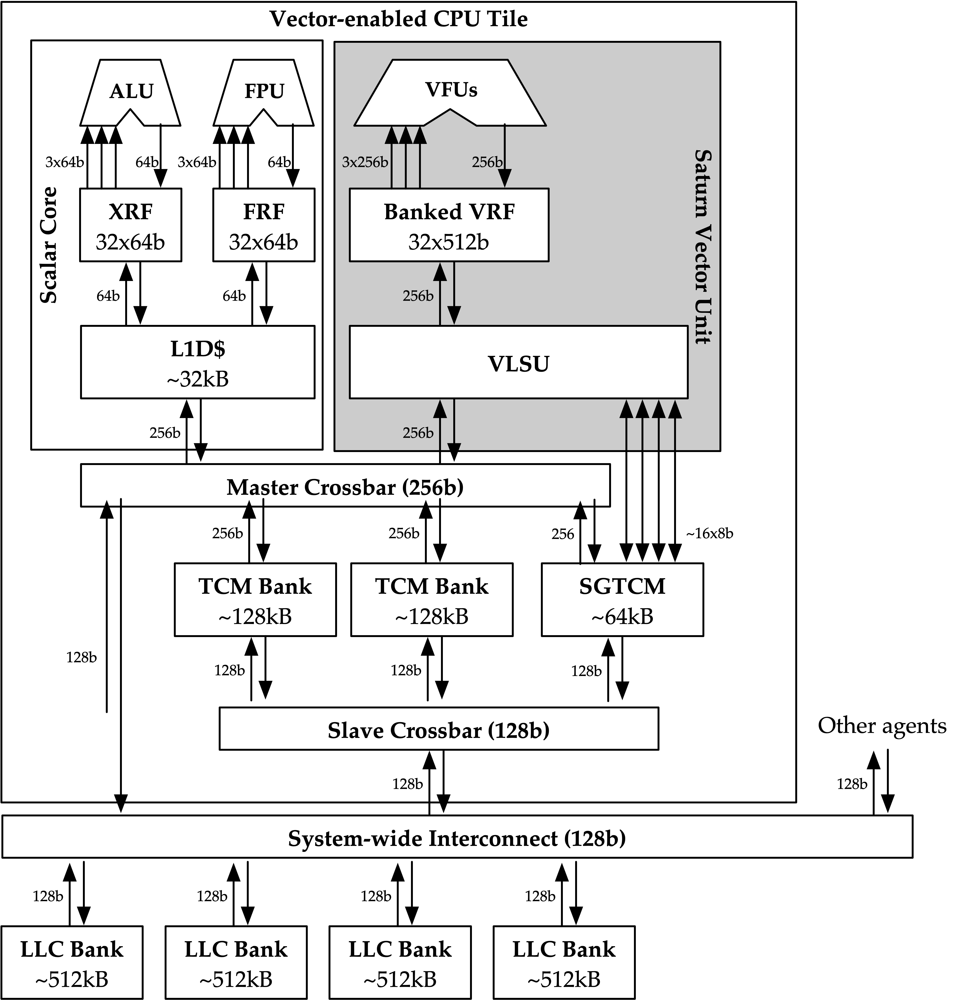
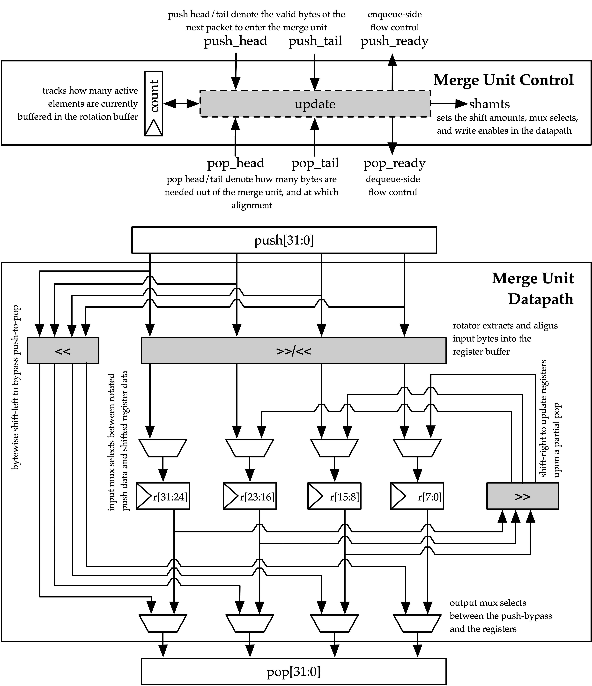

[[memory]]

== Vector Load-Store Unit

[.text-center]
.Vector Load-Store Unit Diagram

The Vector Load-Store Unit (VLSU) contains independent paths for loads and stores.
The load path performs load address generation and reformatting of load responses into load writebacks.
The store path performs store address generation and reformats vector register data into store requests.
Each path is designed to saturate a block memory interface that is DLEN bytes wide.

Each path is designed as an in-order pipeline of units with latency-insenstive interfaces.
The control signals for each unit are driven by pointers into the load/store instruction queues (VLIQ/VSIQ).
An independent pointer for each unit is maintained, so each unit can operate on the same, or different instructions within the queues.
After an instruction has finished execution in each unit in that path, its entry in the instruction queue can be freed.

The load path consists of the following stages:

 * Load Address Sequencer (LAS)
 * Load Reordering Buffer (LROB)
 * Load Response Merger (LMU)
 * Load Segment Buffer (LSB)

The store path consists of the following stages:

 * Store Segment Buffer (SSB)
 * Store Data Merger (SMU)
 * Store Address Sequencer (SAS)
 * Store Acknowledgement Unit (SAU)

The store path is very similar to the reverse of the load path.
Notably, the SAS is identical to the LAS, while the SMU is identical to the LMU.

The VLSU additionally contains a specialized address sequencer for accessing a specialized memory region for high throughput scatter and gather - the Scatter-Gather Address Sequencer (SGAS).
Indexed loads and stores which access a physical region managed by the scatter-gather memory use the SGAS for address sequencing, instead of the LAS or SAS, respectively.

=== Memory System

The VLSU assumes integration into a memory system that maintains coherence between VLSU accesses and scalar accesses into a scalar L1.
The VLSU exposes a generic load/store decoupled request and response interface.
This is typically converted into a TileLink interface within either Rocket or Shuttle.

[.text-center]
.Example default configuration of the Saturn memory system

One approach would be to direct all vector memory accesses into the scalar L1.
While simple, such an approach would induce frequent structural hazards and require a specialized host core with a specialized L1 data cache.
While the Saturn VLSU does support this approach, the standard and preferred mechanism is to provide a vector-specific memory port that bypasses the L1 and accesses coherent backing memory.
Figure 16 depicts this memory system.

[.text-center]
.Example Saturn memory system with high-bandwidth local TCM (Tightly-coupled memory)

Saturn configurations with high `DLEN` would generally require higher memory bandwidth.
However, scaling up the system-level interconnect to meet Saturn's bandwidth demands may be prohibitively costly.
Instead, the preferred approach for high-`DLEN` Saturn configs is to integrate a high-bandwidth local TCM (tightly-coupled-memory), which software should treat as a software-managed cache for vector accesses.
This TCM should be tile-local and globally addressable, but not necessarily cacheable.
Figure 17 depicts a Saturn configuration with a high-bandwidth TCM, but lower-bandwidth system interconnect.

[.text-center]
.Example Saturn memory system with high-bandwidth local TCM and scatter-gather TCM (SGTCM)

Saturn also supports integration into a system with a specialized "scatter-gather memory" (SGTCM).
Unlike the standard memory interface, which supports one address per cycle for loads and one address per cycle for stores, the SGTCM interface presents an array of parallel byte-wide ports.
The SGTCM is intended to be implemented as a specialized non-cacheable core-local memory.

=== Memory Disambiguation

Saturn is responsible for interlocking vector or scalar requests if an older vector or scalar request has not been made visible to the coherent memory system.

* A younger scalar load must stall until all older vector stores to the same block have been issued and acknowledged.
* A younger scalar store must stall until all older vector loads to the same block have been completed and all older vector stores to the same block have been issued and acknowledged
* A vector load or store cannot begin execution while there are pending older scalar stores in the scalar store buffer

The VLSU does not assume that the vector memory interface will respond to requests in-order.
This necessitates the implementation of a load-reordering buffer.
Saturn supports a LROB with as many buffer entries as possible inflight requests.
Saturn additionally supports implementing the LROB with fewer buffer entries than possible inflight requests, for use in scenarios where te outer memory system generally preserves response order, but is not guaranteed to.
In this configuration, the LROB will replay loads when the LROB's buffers overflow, preserving an in-order response stream into the LMU.

=== Inflight Instruction Queues

Upon dispatch from the VFU into the VLSU, a vector memory instruction is writen into either the load instruction queue (VLIQ) or store instruction queue (VSIQ).
Instructions are additionally tagged with a unique age tag (VAT) that is allocated at dispatch, and freed when an instruction exits the queue.

Each entry in this queue contains the base offset, physical page index, and stride.
As a consequence of the VFU cracking memory instructions into single-page accesses, the base offset and stride are stored as 12 bits of page offset.
Each entry additionally contains the `vstart`, `vl`, `segstart`, and `segend` settings of this instruction, along with all the fields for addressing mode, element width, index width, and mask control.

The entry also contains a bound (extent) for the instruction's memory access within its accessed page.
This is derived from the base offset, stride, `vl`, and addressing mode settings of the instruction, but is encoded directly within the entry to enable fast ordering checks.
Instructions with indexed accesses are marked conservatively to potentially access the entire page.

Memory disambiguation checks are performed using a CAM over all the entries in the VLIQ and/or VSIQ to find the entries accessing the same page.
The base and extent of a given access can be checked against the base and extent of the access in the entry to determine if there is overlap.
Both vector-vector and vector-scalar ordering checks use this CAM.

=== Address Sequencing

The Address Sequencers (LAS/SAS) generate memory access requests for all memory instuctions except for indexed accesses into the SGM.
The address sequencers emit aligned requests aligned to the width of the memory interface.
The sequencer can proceed with an instruction if it determines via the instructions age tag and the VLIQ/VSIQ that there is no potential ordering hazard.

The address sequencers effectively iterate over two nested loops.
The outer loop iterates over element index, while the inner loop iterates over a "segment index" within a segment for segmented access.
A index port and mask port provide a stream of indices/masks generated by the VU for indexed and/or masked operations.

Unit-strided (segmented and non-segmented) accesses do not execute the inner loop, and iterate the outer loop by the number of elements requested by the next request.
These requests saturate the available memory bandwidth.
Masked unit-strided loads ignore any mask settings, instead applying the mask to control writeback in the VU.
Masked unit-strided stores receive a mask from the SMU, and do not read a mask from the mask port.

Strided and indexed non-segmented accesses do not execute the inner loop, and iterate the outer loop by a single element per cycle.
A mask is generated to select the active bytes within the access for the requested element.
These accesses use the mask port if set by the instruction, and omit generating the request if the element is masked off.

Strided and indexed segmented acceses execute both the outer and inner loop.
The inner loop iterates by the number of elements within a segment available within the next segment, while the outer loop iterates by a single element.
These access the mask port if set by the instruction, and omit generating the request if the element is masked off.
Generally, these can saturate the memory bandwidth when the size of one segment is large

The sequencers will stall if the memory interface is not ready or if there are no more tags to track outstanding memory accesses.
When the last request for an instruction has been sent to the memory system, the pointer into the VLIQ/VSIQ for the instruction is incremented, and the next instruction to undergo address sequencing can proceed.

=== Merge Unit

[.text-center]
.Control and datapath of the merge units. The merge unit can be considered a generalized rotation buffer, where the enqueue and dequeue sides are each latency-insensitive interfaces requesting an update (either a push or pop) of some segment of contiguous valid data into or out of the merge buffer.

The merge units are general-purpose circuits that correct for misalignment of the memory system response data before the next step in the load or store paths.
These can be considered a generalized form of a rotation buffer, decoupling the alignment and extent of input data from the alignment and extent of output data, and preserving latency-insensitive decoupled interfaces.

The merge units have FIFO semantics, where the enqueue into the unit specifies a base and extent of active data within the wide input vector.
The merge unit rotates away the inactive bytes, compacting the active bytes into contiguous storage.
The dequeue requests a base and extent from the merge unit, which then shifts the buffered data into position.
A bypass path from the enqueue to the dequeue enables full-throughput continuous dataflow for misaligned contiguous accesses.

For the LMU, the push base and extent (head and tail) are set by the address offset associated with the original memory request.
For block-contiguous accesses, only the first and last beat of a single access would encode a non-aligned head or tail, respectively.
For element-indexed or strided accesses where each memory request contains only a single valid element, the push head and tail denote the start and end byte of the active element.
In this way, the LMU serves double-duty, either rotating block-contiguous accesses or compressing indexed or strided accesses, into aligned `DLEN`-wide contiguous bytes that are directly sequenced by the datapath into register file writes.

For segmented loads, the LMU serves an additional purpose; it enables decoupling of the load writeback sequencing performed by the datapath from the segment buffer.
That is, the segment buffer does not necessarily proceed at `DLEN` bits per cycle for all segment sizes.
Depending on the segment size, the segment buffer may request a sub-`DLEN` slice of bytes, which the LMU will gracefully provide once available.

The SMU operates as the reversed path of the LMU.
The push head and tail of the SMU are usually aligned, except for the last element group when `VL` is misaligned.
For segmented stores, the push head and tail may be set by the store segment buffer, instead of the store datapath.
The pop head and tail are driven by the addresses generated by the SAS.
Notably, the SMU additionally tracks a byte-wise mask bit for masked stores, such that the mask can be applied to the generated store request.

=== Segment Buffer

Non-segmented accesses bypass the segment buffer units entirely.
For segmented accesses to proceed with high throughput, the LSB and SSB must "buffer" a sufficient number of responses to "transpose" a set of segments into a set of vector writebacks, or a set of vector store-data into a set of segments.

Each segment buffer is implemented as a double-buffered 2D array of flops.
The double-buffering enables full rate segmented accesses.
For instance, in the LSB, one half is filled by load responses while the other is drained by load writeback.

Each segment buffer is 8 rows deep to support up to 8 fields in a segment, as required by the specification.
Each segment buffer is DLEN bits wide to be able to buffer entire element group of writeback data.

Load responses from the LMU write columns into the LSB, while the LSB emits rows into the load writeback port to the VU.
Store data from the VU writes rows into the SSB, while the SSB emits columns into the SMU.

[.text-center]
.Table depicting behavior, storage layout, and throughput of the double-buffered LSB for varying NF/ELEN on a DLEN=64b configuration..
image::diag/segbuf.png[Merge unit,width=900,align=center,title-align=center]

Table 20 depicts how the LSB requests aligned segments from the LMU, stores them in a 2D segment buffer array, and sequences some series of aligned write-back data to the datapath.
Notably, some configurations of `NF` and `ELEN` result in sub-optimal throughput, underutilizing the memory system.
Some obvious optimizations have yet to be implemented to improve the throughput of the power-of-two `NF` instructions.
