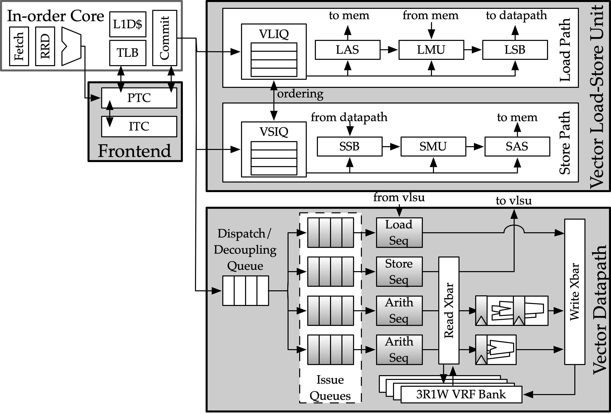

[[system]]
== System Overview

Saturn is implemented using the Chisel hardware description language, and is intended to integrate into existing Chisel-based cores as part of the open-source Chipyard SoC framework.
The generator is a parameterized Scala program that uses the Chisel embedded DSL to generate a synthesizable RTL circuit given a user-defined configuration.

=== Organization
[.text-center]
[#overview]
.Overview of Saturn's Microarchitecture

Saturn is organized into three main components, as shown in <<overview>>.

The *Vector Frontend (VFU)* integrates into the pipeline of the host RISC-V core.
In in-order cores, the stages of the VFU align with the pre-commit pipeline stages of the host core.
All vector instructions are passed into the vector frontend.
The VFU performs early decode of vector instructions and checks vector instructions for the possibility of generating a trap, through performing address translation of vector memory address operands.
Instructions that do not trap are passed to the other vector components once they have also passed the commit stage of the scalar core.

The *Vector Load-Store Unit (VLSU)* performs vector address generation and memory access.
Inflight vector memory instructions are tracked in the vector load-instruction-queue (VLIQ) and store-instruction-queue (VSIQ).
The load/store paths within the VLSU execute independently and communicate with the VU through load-response and store-data ports.

The *Vector Datapath (VU)* contains instruction issue queues (VIQs), vector sequencers (VXS/VLS/VSS), the vector register file (VRF), and the SIMD arithmetic functional units (VEUs/VFUs).
The sequencers schedule register read/write and issue operations into the VEUs, while interlocking on structural and data hazards.
The VU is organized as a unified structure, instead of distributing the VRF and VEUs across vector lanes.
This approach is better suited for compact designs, where scalability to ultra-wide datapaths is less of a concern.

=== Key Ideas

Several key principles drive the design of Saturn's microarchitecture.

Saturn relies on *post-commit-execution* of all vector instructions.
That is, the VLSU and VU only receive committed instructions from the VFU.
As physical addresses are passed from the VFU into the VLSU, the VLSU will never trap.
This simplifies the microarchitecture of the VLSU and VU, as all operations in these units are effectively non-speculative.
To enforce precise traps ahead-of-commit, Saturn's VFU implements an aggressive, but precise mechanism that validates instructions are free-of-fault and reports any faults precisely if present.

Saturn's microarchitecture is designed around *in-order execution* with many *latency-insensitive* interfaces.
Notably, the load and store paths are designed as pipelines of blocks with latency-insensitive decoupled interfaces.
The load-response and store-data interfaces into the VU are also latency-insensitive decoupled interfaces.
Within the VU, each execution path (load/store/arithmetic) executes instructions in-order.
The in-order execution of the load/store paths aligns with the in-order load-response and store-data ports.

Saturn is organized around a *decoupled access-execute (DAE)* architecture, where the VLSU acts as the "access processor" and the VU acts as the "execute processor".
Shallow instruction queues in the VU act as "decoupling" queues and enable the VLSU's load-path to run many instructions ahead of the VU.
Similarly, the VLSU's store path can run many cycles behind the VU through the decoupling enabled by the VSIQ.
This approach can tolerate high memory latencies with minimal hardware cost.

Saturn still supports a limited, but sufficient capability for *out-of-order execution*.
The load, store, and execute paths in the VU operate independently of each other, dynamically stalling for structural and data hazards without requiring full in-order execution.
Allowing dynamic "slip" between these paths naturally implies out-of-order execution.
To track data hazards, all vector instructions in the VU and VLSU are tagged with a "vector age tag (VAT)".
The VATs are eagerly allocated and freed, and they are referenced in the machine wherever the relative age of two instructions is ambiguous.

To decode vector instructions, the Saturn generator implements an *decode-generator*-driven methodology for vector decode.
The Saturn generator tabularly describes a concise list of all vector control signals for all vector instructions.
Within the generator of the VU, control signals are extracted from the pipeline stages using a generator-time query into the instruction listings.
The results from this query are used to construct a smaller decode table for only the relevant signals, which is passed to a logic minimizer in Chisel that generates the actual decode circuit.
This approach reduces the prevalence of hand-designed decode circuits in the VU and provides a centralized location in the generator where control signal settings can be referenced.
